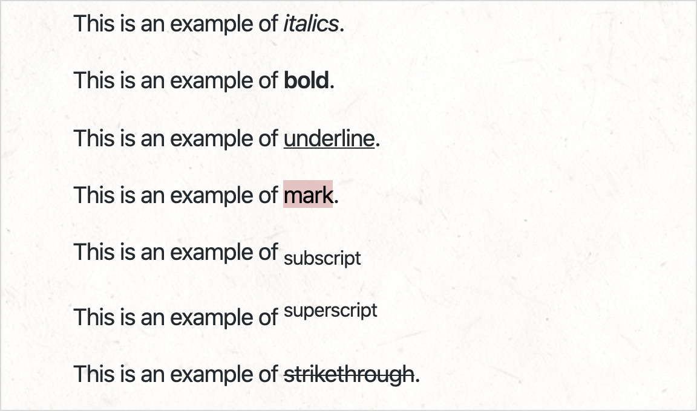
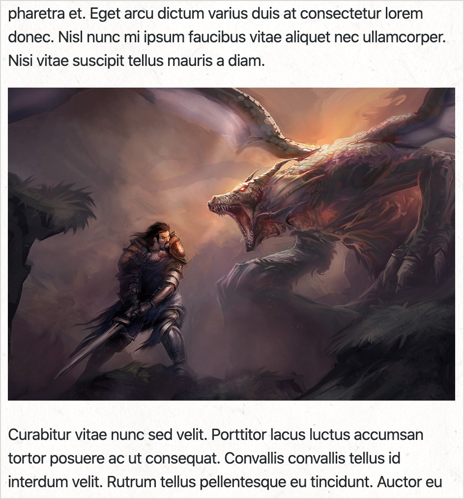
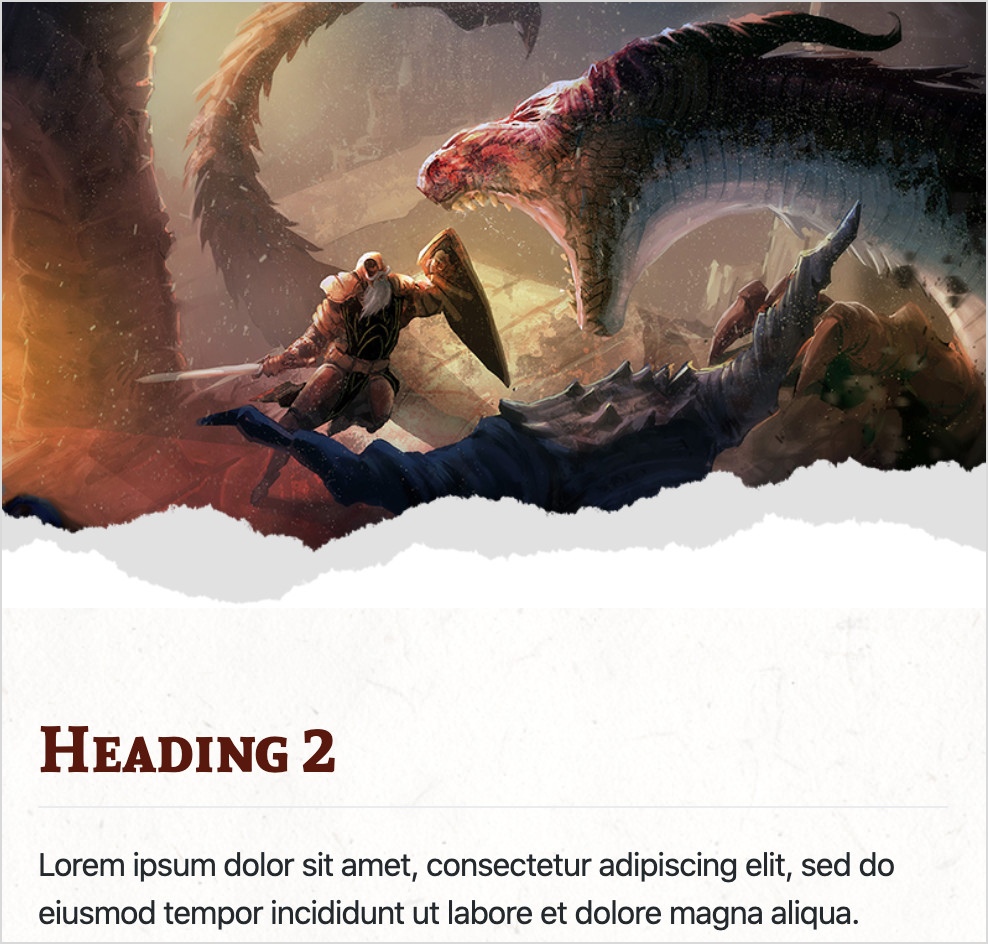
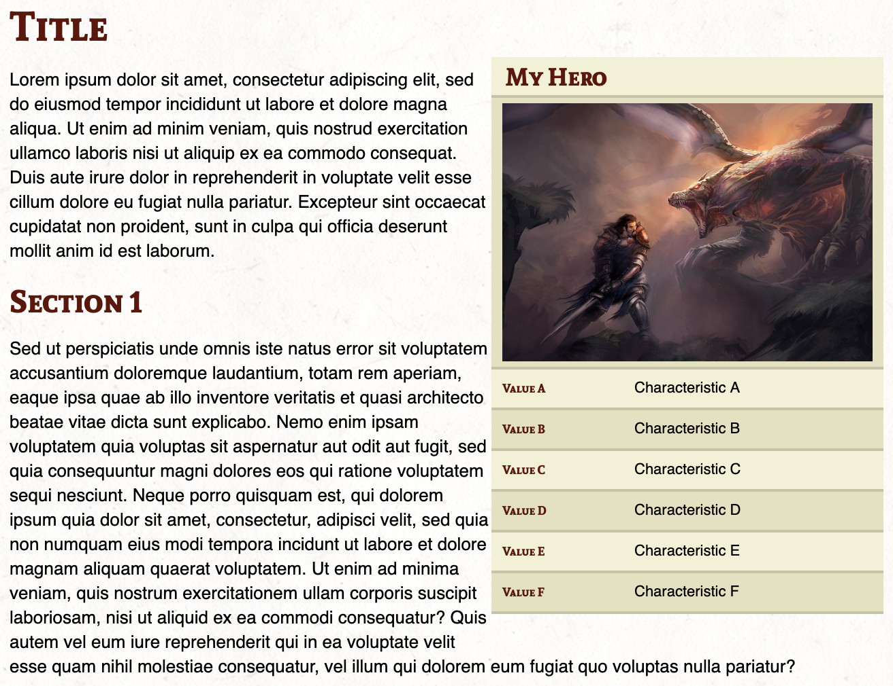

# Markdown Guide

## Getting Started

It's easy to begin creating a module in markdown.

1. Download the Module Packer for [macOS]((https://github.com/encounterplus/module-packer/releases/latest)), [Windows]((https://github.com/encounterplus/module-packer/releases/latest)), or as a [Visual Studio Code Plug-In](https://marketplace.visualstudio.com/items?itemName=JacobJohnston.encounterplus-markdown)!
2. Create a [folder](#Module-Structure) where you will write your module's text and images.
3. Start writing your module content in Markdown.
4. Pack your module so it can be imported by EncounterPlus.
5. Import your module into EncounterPlus!

### Markdown Editors

Markdown can be written with no special tools whatsoever! Simply use your favorite text editor to write the content! That said, there are multitudes of really amazing free markdown editors available that can help author and preview markdown text files. One of the best tools available for authoring EncounterPlus modules is using Visual Studio Code combined with the official EncounterPlus Markdown extension!

## Module Folder Structure

Below is an example of how you might srtucture your Module content.

```
.
└── Group A              # A group for the module.
    ├── Page A.md        # A page in Group A of the module.
    ├── Page A Cover.jpg # An image used in Page A.
    └── Page B.md        # A page in Group A of the module.
└── Group B              # A group for the module.
    ├── Page C.md        # A page in Group B of the module.
    └── Page D.md        # A page in Group B of the module.
└── Images               # A folder to store shared images.
    ├── .ignoregroup     # An empty file that instructs the Module Packer not to turn this into a Group
    ├── Image1.png       # An image used in multiple pages.
    └── Image2.jpg       # An image used in multiple pages.
└── ModuleBuild          # Contains temporary module files (Module Packer will create this folder)
    └── Assets           # Contains styles and assets for the module (Module Packer will create this folder)
├── module.json          # Optional - can define attributes of the module (e.g., Title, Author, Slug, etc.)
└── My Module.md         # A page at the root level of the module.
```

### Module Properties (module.json)

In the root folder of your module project, you can create a file named `module.json` to define properties about the module. If module.json does not exist, essential properties like `name` and `slug` will be inferred from the module's folder name. A more thorough guide to module.json is available.

```JSON
{
  "name": "Example Module",
  "slug": "example-module",
  "description": "Example module description.",
  "category": "adventure",
  "author": "Dungeony MasterFace",
  "code": "ABC-123",
  "cover": "cover.jpg",
  "version": 4,
  "autoIncrementVersion": true
}
```

The `id` value can also be specified (as a UUID string) to cause a module to be overwritten rather than duplicated when repeatedly imported. However, this is not advised as repeated module imports can cause duplicate groups and pages to be created unless care is taken to ensure they, also, have a manual ID specified.

The `autoIncrementVersion` field will cause the version number to automatically increment each time the module is packed. This is useful for keeping track 

### Groups and Folders

Subdirectories under the main module folder will automatically be turned into Groups in the module. To have a folder *not* be made into a Group, create a file named `.ignoregroup` in the folder. That folder and all subfolders will no longer be turned into groups. They will, however, be included as a resource folder in the module (e.g. for the `images` folder).

### Markdown File Front-Matter

Each markdown document can contain front matter block for additional configuration.

```yaml
---
id: 553e68cc-2f81-4a9d-9008-d0a39269da4e
name: Page name
slug: page-name
pagebreak: h1,h2,h3
---
```
> `id` - An optional parameter (string) used as a unique identifier for the page. If not provided, UUIDv4 string will be automatically generated.

> `slug` - An optional parameter (string) used for referencing pages (see links below). If not provided, it's automatically generated.

> `pagebreak` - An optional parameter which can be used for splitting single markdown document into multiple pages. The splitting is done automatically, based on the heading level array specified in this parameter and the actual content in the document. It's useful for describing map locations which can be added later as pins.

## Markdown Guide

### Markdown Syntax

Below you will find examples of markdown syntax with images as it will appear in Encounter Plus. While EncounterPlus supports nearly all of the traditional markdown tags, it also supports many non-standard tags as well.

#### Headings

A single hash symbol denotes a first-level heading, two hash symbols is a second-level heading, three hash symbols is third-level, etc. Note that text content that occurs immediately after a first level heading will have a fancy first letter. 

```Markdown
# My Heading 1 
```


```Markdown
## My Heading 2
```


```Markdown
### My Heading 3
```


```Markdown
#### My Heading 4
```


```Markdown
##### My Heading 5
```


```Markdown
###### My Heading 6
```


#### Standard Text Format Styles

Below is an example of standard text format styles in markup:

```Markdown
This is an example of *italics*. 

This is an example of **bold**.

This is an example of _underline_.

This is an example of ==mark==.

This is an example of ~subscript~

This is an example of ^superscript^

This is an example of ~~strikethrough~~.
```

And their corresponding appearance:


#### Images

An image is shown by using an exclamation point, followed by a description in brackets, followed by a link to the image file in parantheses.

```Markdown

```


By default, in markdown, an image will take the full width of the page, minus any default margins. An image can be more manually sized by adding a space, and equals sign, and dimensions after the image.

```Markdown

```


If you are only interested in specifying the width, and allowing the image to size its height by the innate aspect ratio, simply forego specifying the height.

```Markdown

```

Finally, a special cover image style may be placed above the top header. This is specified by adding the text `{.size-cover}` after the image.

```Markdown
{.size-cover}

## Heading 2
```


#### Text Blocks (Block Quotes)

You can add default text block with standard block quote syntax:

```Markdown
> Text block
```


`Read Aloud` text by adding custom class `read` to standard block quote:

```Markdown
> Read aloud text
{.read}
```


#### Links

Normally, in markdown, links would be used to link to other webpages. However, in EncounterPlus, you can add links to any monster, player, item and spell in the compendium or to other pages or maps.

```Markdown
[Goblin](/monster/goblin)
[Staff of Power](/item/staff-of-power)
[Fireball](/spell/fireball)
[Example page](example-page)
```

#### Tables

The Module Packer and Visual Studio Code extension support the standard Markdown table format. In addition, the MultiMarkdown table formatters are also supported for advanced table constructs like cell spans and column spans.

```Markdown
|   d100   | Magic Item                |
|----------|---------------------------|
| 01-50    | Potion of Healing         |
| 51-60    | Spell scroll (cantrip)    |
| 61-70    | Potion of climbing        |
| 71-90    | Spell scroll (1st level)  |
| 91-94    | Spell scroll (1st level)  |
| 95-98    | Potion of greater healing |
| 99       | Bag of holding            |
| 00       | Driftglobe                |
```

In addition, table colors can be customized with by adding the `{.green}`, `{.red}`, `{.blue}`, `{.yellow}`, `{.gray}`. Additionally, the `{.headerTitle}` style can be added to change the header text appearance.

```Markdown
|   d100   | Magic Item                |
|----------|---------------------------|
| 01-50    | Potion of Healing         |
| 51-60    | Spell scroll (cantrip)    |
| 61-70    | Potion of climbing        |
| 71-90    | Spell scroll (1st level)  |
| 91-94    | Spell scroll (1st level)  |
| 95-98    | Potion of greater healing |
| 99       | Bag of holding            |
| 00       | Driftglobe                |
{.blue,.headerTitle}
```


A special, right-floating stat block style table can be applied by using the {.}

```Markdown
|  My Hero                         ||
|----------|------------------------|
|                 ||
| Value A  | Characteristic A       |
| Value B  | Characteristic B       |
| Value C  | Characteristic C       |
| Value D  | Characteristic D       |
| Value E  | Characteristic E       |
| Value F  | Characteristic F       |
{.statblock}
```


### Visual Studio Code - Getting Started

TODO
