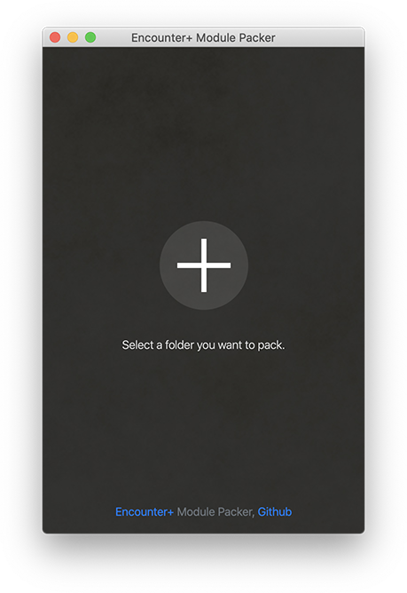

# EncounterPlus Module Packer

Simple desktop application for converting markdown documents into EncounerPlus compatible .module files.



## Installation

Download the application flavour for your plattform from the [Latest Releases](/encounterplus/module-packer/releases/tag/v0.9.0/) section or clone this repository and run it from command line.

```
npm install
npm start
```

## Usage

1. Select a folder containing some markdown formatted documents you want to convert and pack. 
2. Change the name of your module.
3. Click on the "Create module" button
4. Click on the link to reveal the .module file in your file browser.
5. Import generated .module file into EncounterPlus iOS app using app settings.

## Example content

Use the content of the [example.zip](example.zip) for testing.

## Markdown structure

### Front matter

Each markdown document can contain front matter block for additional configuration.

```yaml
---
id: 553e68cc-2f81-4a9d-9008-d0a39269da4e
name: Page name
slug: page-name
pagebreak: h1,h2,h3
---
```

> Pagebreak is an optional parameter which can be used for splitting single markdown document into multiple pages. The splitting is done automatically, based on the heading level array specified in this parameter and the actual content in the document. It's useful for describing map locations which can be added later as pins.

### Links

You can add links to any monster, player, item and spell in the compendium or to other pages or maps. Examples in markdown:

```md
[Goblin](/monster/goblin)
[Staff of Power](/item/staff-of-power)
[Fireball](/spell/fireball)
[Example page](example-page)
```

### Images

You can add images using standard mardown syntax:

```md


```

## License

[CC0 1.0 (Public Domain)](LICENSE.md)
