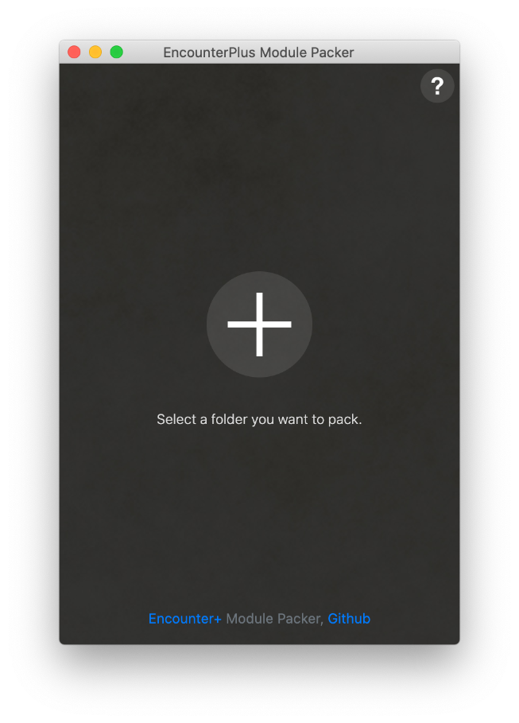
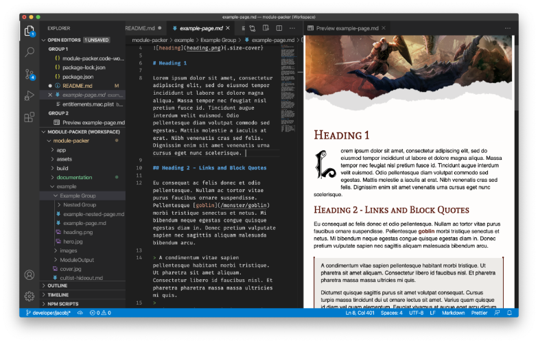
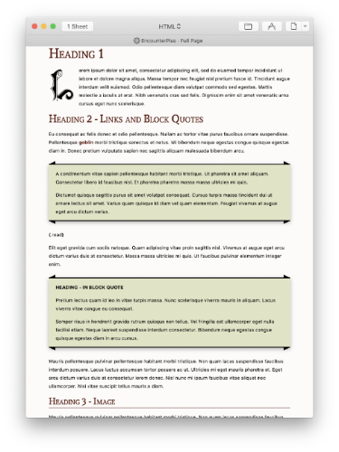

# EncounterPlus Module Packer

Simple desktop application for converting markdown documents into EncounterPlus compatible .module files.



## Installation

Download the application for your plattform from the [Latest Releases](releases/latest).

To run module-packer from code, you will need Node Package Manager (npm) installed. Once npm is installed, clone this repository and run the following from your command line.

```
npm install
npm start
```

## Usage

1. Select a folder containing some markdown formatted documents you want to convert and pack. 
2. Change the name of your module.
3. Click on the "Create module" button
4. Click on the link to reveal the .module file in your file browser.
5. Import generated .module file into EncounterPlus iOS app using app settings.

## Example content

Use the content of the [example.zip](example.zip) for testing.

## Markdown structure

### Front matter

Each markdown document can contain front matter block for additional configuration.

```yaml
---
id: 553e68cc-2f81-4a9d-9008-d0a39269da4e
name: Page name
slug: page-name
pagebreak: h1,h2,h3
---
```
> *id* is an optional parameter (string) used as a unique identifier for the page. If not provided, UUIDv4 string will be automatically generated.

> *slug* is an optional parameter (string) used for referencing pages (see links below). If not provided, it's automatically generated.

> *pagebreak* is an optional parameter which can be used for splitting single markdown document into multiple pages. The splitting is done automatically, based on the heading level array specified in this parameter and the actual content in the document. It's useful for describing map locations which can be added later as pins.

### Links

You can add links to any monster, player, item and spell in the compendium or to other pages or maps. Examples in markdown:

```Markdown
[Goblin](/monster/goblin)
[Staff of Power](/item/staff-of-power)
[Fireball](/spell/fireball)
[Example page](example-page)
```

### Images

You can add images using standard markdown syntax:

```Markdown


```

Image sizes can be applied using the extended image size format. For example:
```Markdown

```

Or, if you only want to specify a width and have the height automatically adjusted:
```Markdown

```

A cover image can be made to extend to the edges of the page to match traditional RPG manual style by using the "size-cover" class. These are meant to come before the top heading, however, if using the "pagebreak" parameter, make sure you place your cover images after the heading and they will automatically be moved to the top of the page.

Cover image example when NOT using pagebreaks:
```Markdown
{.size-cover}

# My Title
```

Cover image example when using pagebreaks:
```Markdown
# My Title
{.size-cover}
```

### Text blocks

You can add default text block with standard block quote syntax:

```Markdown
> Text block
```

Or `Read Aloud` text by adding custom class `read` to standard block quote:

```Markdown
> Read aloud text
{.read}
```

### Groups

Subdirectories under the main module folder will automatically be turned into Groups in the module. To have a folder *not* be made into a Group, create a file named ".ignoregroup" in the folder. That folder and all subfolders will no longer be turned into groups. They will, however, be included as a resource folder in the module (e.g. for the "images" folder).

## Markdown Editors

Any markdown editor can be used to author content that will be compatible with EncounterPlus. Below you will find instructions on how to configure various editors so that your markdown previews more-closely match the way EncounterPlus will render the content.

After running the module packer for the first time, the default stylesheets EncounterPlus uses to render markdown pages will be placed in the "ModuleOutput/Assets". Note that most editors do not currently support the special attributes mentioned above, such as "no-fancy", "read", and "size-cover".

### Visual Studio Code


Visual Studio Code has great support for rendering markdown with custom styles out-of-the-box. However, with the help of the [EncounterPlus Markdown Extension](https://marketplace.visualstudio.com/items?itemName=JacobJohnston.encounterplus-markdown), Visual Studio Code can preview markdown pages as if they were already run through the Module Packer and rendered in EncounterPlus. Simply install the plugin and preview your markdown documents.

Optionally, if you want to preview the custom styling in your module, do the following (*this only needs to be done if you've modified custom.css*):
1. In Visual Studio Code, go to Settings -> Extensions -> Markdown -> Styles
2. Add a Style and point it to the "ModuleOutput/Assets/css/custom.css" file.

### Ulysses
User Team-Hufflepuff has created a wonderful style for Ulysses that allows previewing markdown authored in Ulysses as it would show in EncounterPlus. Ulyssess does not currently support HTML or the extended attributes. Download the [EncounterPlus Ulysses plugin here](documentation/EncounterPlus.ulstyle).



#### Other Editors
Have you supported EncounterPlus's style in another editor? Let us know on [Discord](https://discord.gg/rc8Bez8)!

## License

[CC0 1.0 (Public Domain)](LICENSE.md)
